# Standalone CyberArk Conjur Enterprise and OpenShift LAB
This project will help you to quickly build up the standalone, single VM lab environment to test conjur and openshift application integration including:
- Redhat OpenShift running on local VM
- CyberArk Conjur Enterprise for secrets management 
- Conjur jwt authentication method
- Conjur push to k8s file
- Conjur push to kubernetes secret
- Conjur secretless broker
- Conjur and Java SpringBoot plugin
- and more

All setup, installing and configuration steps are all put in sequence of scripts to make the setup process quicker and easier

Comments and question, please send to <huy.do@cyberark.com>

Thanks and kudos to @Joe Tan (joe.tan@cyberark.com) for the detail of installing and configuration guide at https://github.com/joetanx

### Video on step by step setting up this LAB is at [[https://TODO-VIDEO]]

# PART I: SETING UP ENVIRONMENT
# 1.1. LAB Prerequisites
- ESXI server or VMWorkstation to create standalone lab VM as below:
  - 12GB RAM (minimum), recommended 16GB
  - 4 vCore CPU
  - 120GB HDD
  - CentOS Stream 9 base OS (Minimal Install)
    - Hostname: ocp.demo.local
    - LAN IP (eg 172.16.100.14/24)
    - Internet connection to do os updating and packages installation
- Conjur appliance images & utilities:
  - Contact CyberArk local representative for following images and tools
    - conjur-appliance-Rls-v13.1.0.tar.gz
    - conjur-cli-go_8.0.12_linux_386.tar.gz
  - CyberArk softwares and related tools can be downloaded at https://cyberark-customers.force.com/mplace/s/#software
- Download Openshift Local installation package and pull secret
  - Crc installation package for linux: https://console.redhat.com/openshift/create/local
  - Download pull secret and save it to file pull-secret.txt

#### *The IP addresses in this document are using from current lab environment. Please replace the **172.16.100.14** by your actual **VM IP**’s

#### *You will need to setup the DNS system or modify your hosts file to map all below domain name to the Openshift VM's IP 

Domain for Openshift GUI and authentication
- console-openshift-console.apps-crc.testing 
- oauth-openshift.apps-crc.testing

Domain for Conjur GUI
- conjur-master.demo.local

Domain for web applications
- cityapp-hardcode-cityapp.apps-crc.testing
- cityapp-conjurtok8sfile-cityapp.apps-crc.testing
- cityapp-conjurtok8ssecret-cityapp.apps-crc.testing
- cityapp-secretless-cityapp.apps-crc.testing
- cityapp-springboot-cityapp.apps-crc.testing

# 1.2. VMs Preparation
## **Step1.2.1: Preparing CentOS Stream 9**
CentOS Stream 9 can be downloaded at https://www.centos.org/download/

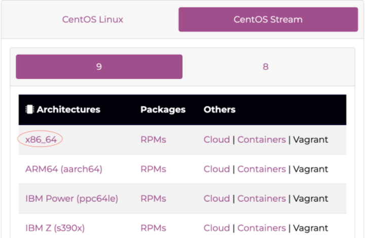

Creating VM and installing with minimal install option

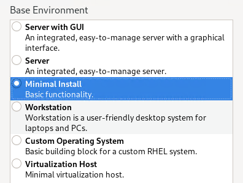

- Checking for IP, DNS and Internet connection
- Updating the os and installing git tool
```
dnf -y update
dnf -y install git
```
## **Step1.2.2: Copying files for setting up**
Login to VM as root, creating folder for setup_files
```
mkdir -p /opt/lab/setup_files
chmod 777 /opt/lab/setup_files
```
Copy conjur appliance image file to setup_files folder
- Conjur docker image: conjur-appliance-Rls-v13.1.0.tar.gz
- Conjur cli tool for linux: conjur-cli-go_8.0.12_linux_386.tar.gz
- Redhat Openshift Crc installation package: crc-linux-amd64.tar.xz
- Pull secret file: pull-secret.txt

## **Step1.2.3: Cloning git hub repo**
Login to VM as root and running below command
```
cd /opt/lab
git clone https://github.com/huydd79/conjur-ocp.local-lab
```
Git cloning provides 4 sub folders for diffirent setup
- 1.crc-setup: scripts to setup OpenShift Local cluster environment
- 2.conjur-setp: scripts to install podman, mysql, conjur master containers and deploying conjur follower in k8s
- 3.cityapp-php: scripts to deploys different types of cityapp application using php code
- 4.cityapp-springboot: script to deploy a sample springboot application using conjur-springboot-plugin and jwt authentication method

Each folder will have ```00.config.sh``` which contains some parameters. Review file content, change all related parameters to actual value and set ```READY=true``` before doing further steps.

# PART II: SETING UP CONJUR - OPENSHIFT LAB
# 2.1. Setting up OpenShift Local standalone cluster
## **Step2.1.1: Preparing crc installation**
Login to VM as root, running below command to download and setup crc environment
```
cd /opt/lab/conjur-ocp.local-lab/1.crc-setup/
./11.crc-preparing.sh
```
You will need to provide new password for crcuser after run above script. After script completed, double check the result by running ```crc``` command. If command is not available, run ```01.installing-crc.sh``` again and doublecheck.

After this step, you MUST login to the VM using crcuser to continue the installation process. Using command ```ssh crcuser@localhost``` to get completely new login session with this user.
#### NOTE: using su or sudo will not provide a full login session and makes the installation process failed.

## **Step2.1.2: Installing kubelet kubeadm and kubectl**
Login to VM as crcuser, running below command to download and install openshift
```
cd /opt/lab/conjur-ocp.local-lab/1.crc-setup/
./12.crc-installing.sh
```
This process will take few minutes (up to hours depends on Internet connection). About 17GB of data will need to be downloaded from Internet and installed to CRCVM.

## **Step2.1.3: Starting CRC and Openshift cluster**
Login to VM as crcuser, running below command to start Openshift local service
```
cd /opt/lab/conjur-ocp.local-lab/1.crc-setup/
./13.crc-start.sh
```
There will have some error notification related to ssh connection or pull secret, they are normal. If the starting process got failed, try to run crc delete and crc start again.

After the starting process completed successfully, take note of the kubeadmin and developer ‘s credentials and login urls. Checking for crc status and login to openshift cli console with below commands 
#### (NOTE that there have an additional dot before a script path to pull result to environment)
```
cd /opt/lab/conjur-ocp.local-lab/1.crc-setup/
. ./14.crc-login-admin.sh
```
Above script also put crc eval commands to ~/.bashrc file so that the environment setting will be loaded when login again using crcuser later

## **Step2.1.4: Installing HAProxy service**
Login to VM as crcuser, running below command to install HAProxy service
```
cd /opt/lab/conjur-ocp.local-lab/1.crc-setup/
./15.install-haproxy.sh
```
HAProxy service will help to forward ports (tcp/80 and tcp/443) from VM IP to Openshift Node's local IP and do the virtual host proxying for domain conjur-master.{LAB_DOMAIN}, mapping to port 8443

Open browser and check for haproxy status:

http://console-openshift-console.apps-crc.testing:9000/stats

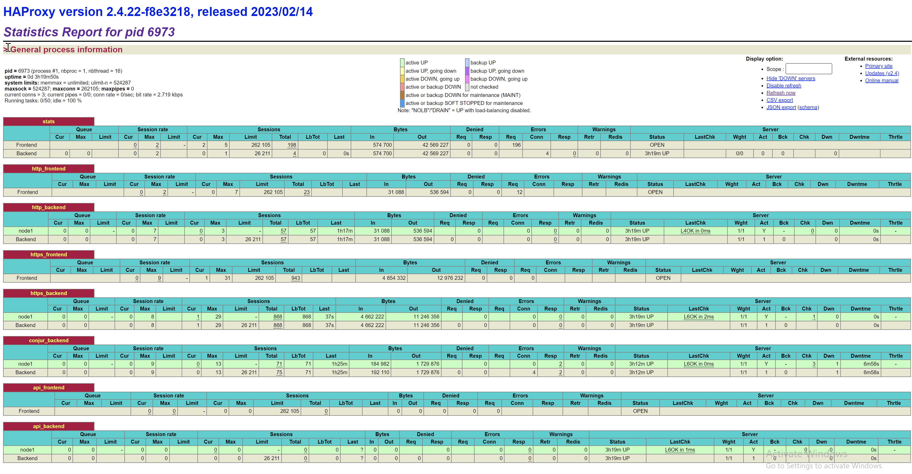

Login to CRC Web Console

<https://console-openshift-console.apps-crc.testing>

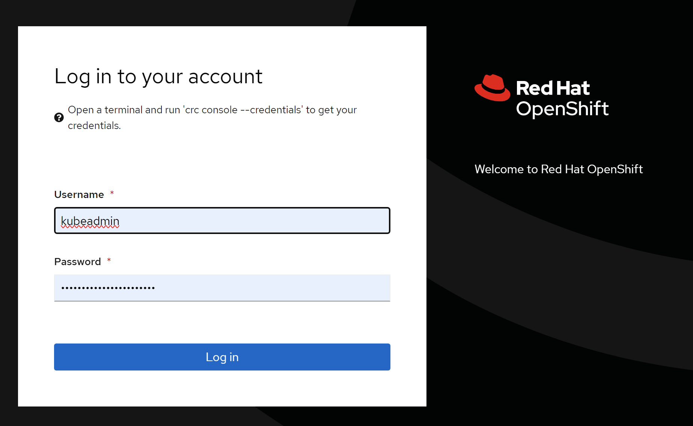

Login to Openshift GUI as kubeadmin user. The login password can be retrieved by using command ```crc console --credentials```

# 2.2. Setting up podman, mysql and conjur environment
## **Step2.2.1: Reviewing 00.config.sh**
Login to VM as crcuser, edit the 00.config.sh
```
cd /opt/lab/conjur-k8s-lab/2.conjur-setup
sudo vi 00.config.sh
```
Changed all related parameters such as IP, domain, password... and set ```READY=true``` to continue
## **Step2.2.2: Installing podman**
Login to VM as root and running below commands
```
/opt/lab/conjur-ocp.local-lab/2.conjur-setup
./21.installing-podman.sh
```
Using ```podman image ls``` to check current podman images

## **Step2.2.3: Setting up mysql container and database**
Login to VM as crcuser and running below commands
```
/opt/lab/conjur-ocp.local-lab/2.conjur-setup
./22.running-mysql-db.sh
```
Using command ```podman container ls``` to make sure mysql container is up and running.
Using command ```ping mysql.demo.local``` to make sure host entry has been added correctly

## **Step2.2.4: Installing conjur master**
Login to VM as crcuser and running below commands
```
/opt/lab/conjur-ocp.local-lab/2.conjur-setup
./23.loading-conjur-images.sh
./24.starting-conjur-container.sh
```
Using command ```podman image ls | grep conjur``` to make sure that image is loaded correctly

Using command ```podman container ls``` to make sure that conjur container is up and running

Using command ```curl -k https://conjur-master.demo.local/info``` to check conjur master status

Using browser and put in conjur master URL ```https://<VMIP>```, login using user admin and password was set in ```00.config.sh``` file
```
https://<VM-IP>/
```

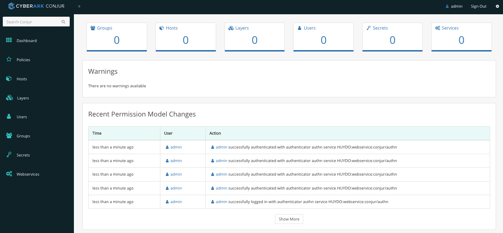

## **Step2.2.5: Installing conjur CLI**
Login to VM as crcuser and running below commands
```
/opt/lab/conjur-ocp.local-lab/2.conjur-setup
./25.installing-conjur-cli.sh
```

Enter ```yes``` for ```Trust this certificate``` question and providing admin password for conjur cli configuration. 

Using command ```conjur whoami``` and ```conjur list``` to doublecheck the result.

## **Step2.2.6: Loading demo data and enable conjur-k8s-jwt authentication**
Login to VM as crcuser and running below commands
```
cd /opt/lab/conjur-k8s-lab/2.conjur-setup
./26.loading-demo-data.sh
./27.enable-k8s-jwt-authenticator.sh
./28.loading-conjur-jwt-data.sh 
```
Using ```curl -k https://conjur-master.demo.local/info``` to see the authenticaion options that are enabled.
```
...
  "authenticators": {
    "installed": [
      "authn",
      "authn-azure",
      "authn-gcp",
      "authn-iam",
      "authn-jwt",
      "authn-k8s",
      "authn-ldap",
      "authn-oidc"
    ],
    "configured": [
      "authn",
      "authn-jwt/k8s"
    ],
    "enabled": [
      "authn",
      "authn-jwt/k8s"
...    
```

Using browser, login to conjur GUI to review the demo data and content. Make sure all authn-jwt/k8s secrets got values
- conjur/authn-jwt/k8s/audience: jwt audience, should be ```cybrdemo``` by default.
- conjur/authn-jwt/k8s/identity-path: jwt path for identity, should be ```jwt-apps/k8s``` by default.
- conjur/authn-jwt/k8s/issuer: jwt issuer, should be ```https://kubernetes.default.svc``` by default
- conjur/authn-jwt/k8s/public-keys: k8s public key information, should be in json format.

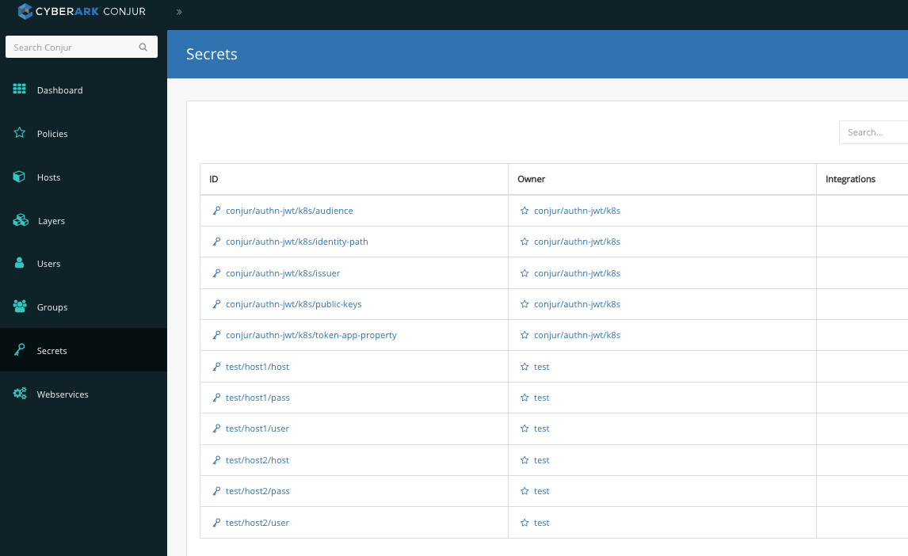

If any of above parameters is emply, please run script ```./28.loading-conjur-jwt-data.sh``` again.

# PART III: TESTING CITYAPP OPTIONS - PHP CODE
# 3.1. Building cityapp image
## **Step3.1.1: Reviewing 00.config.sh**
Login to VM as crcuser, edit the 00.config.sh
```
/opt/lab/conjur-ocp.local-lab/3.cityapp-php
sudo vi 00.config.sh
```
Changed all related parameters such as IP, domain... and set ```READY=true``` to continue
## **Step3.1.2: Building image**
Login to VM as crcuser, review the cityapp image detail on /opt/lab/conjur-k8s-lab/3.cityapp-setup/build
- Dockerfile: contain building info
- index.php: detail code of cityapp web application
Running below command to build cityapp image
```
/opt/lab/conjur-ocp.local-lab/3.cityapp-php
./31.building-cityapp-image.sh
```
Using command ```podman image ls | grep cityapp``` to make sure cityapp image has been build and put at localhost/cityapp

Using command ```oc get is``` to list out container images in Openshift platform

# 3.2. Running cityapp-hardcode
Login to VM as crcuser, running below command to deploy cityapp-hardcode
```
/opt/lab/conjur-ocp.local-lab/3.cityapp-php
./32.running-cityapp-hardcode.sh
```
Using browser and access to ```http://cityapp-hardcode-cityapp.apps-crc.testing``` to open cityapp-hardcode webapp for the result

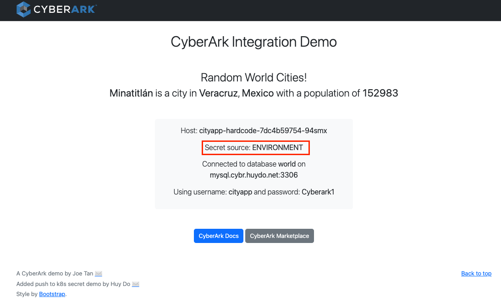

Using OpenShift dashboard GUI and select cityapp namespace to see more detail on cityapp-hardcode pod. This application is being run with database credentials from environment parameters.

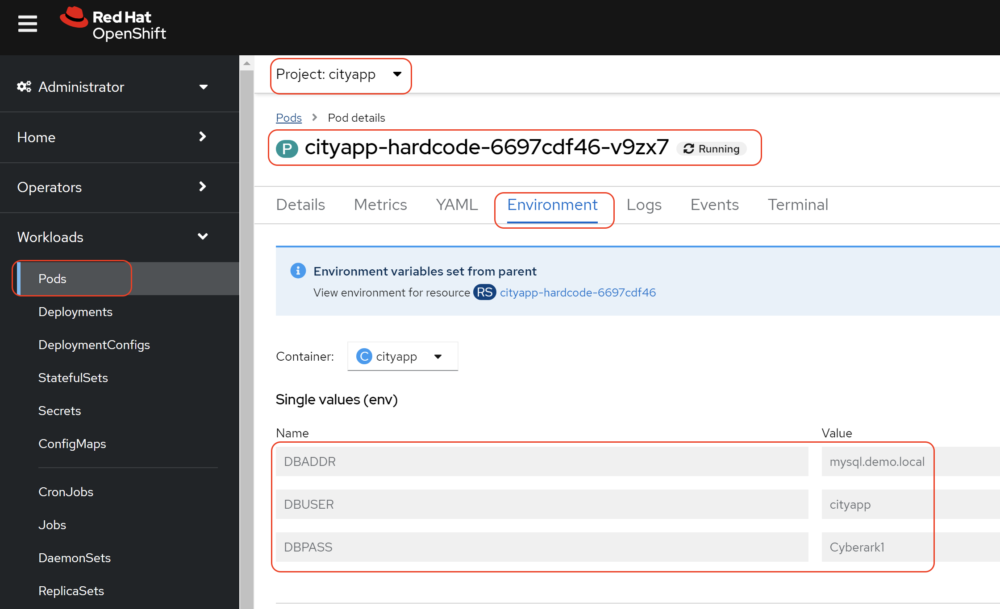

# 3.3. Running cityapp-conjurtok8sfile
Application cityapp-conjurtok8sfile is configured with sidecar container (secrets-provider-for-k8s) which is run in the same pod with cityapp. The sidecar will connect to conjur follower pod, using jwt authentication method and check for database credentials. Information will then be written into ```/conjur/secret``` folder and linked to cityapp's ```/conjur``` folder using shared volume. The architecture of this method is described at below CyberArk document link.

[CyberArk Secret Provider: Push to File mode](https://docs.cyberark.com/Product-Doc/OnlineHelp/AAM-DAP/Latest/en/Content/Integrations/k8s-ocp/cjr-k8s-secrets-provider-ic-p2f.htm?TocPath=Integrations%7COpenShift%2FKubernetes%7CSet%20up%20applications%7CSecrets%20Provider%20for%20Kubernetes%7CInit%20container%7C_____2 "Push to file")


To deploy conjurtok8sfile application, login to VM as root, running below command
```
/opt/lab/conjur-ocp.local-lab/3.cityapp-php
./33.running-cityapp-conjurtok8sfile.sh
```

Going to k8s Openshift GUI, select cityapp namespace and open cityapp-conjurtok8sfile 's sidecar container log, the detail of authentication result will be shown as below
```
INFO:  2022/11/20 17:29:18.217628 main.go:62: CSPFK008I CyberArk Secrets Provider for Kubernetes v1.4.4-5f8218a starting up
INFO:  2022/11/20 17:29:18.219453 main.go:226: CSPFK014I Authenticator setting DEBUG provided by environment
INFO:  2022/11/20 17:29:18.219480 configuration_factory.go:82: CAKC070 Chosen "authn-jwt" configuration
INFO:  2022/11/20 17:29:18.219521 main.go:217: CSPFK014I Authenticator setting CONTAINER_MODE provided by annotation conjur.org/container-mode
INFO:  2022/11/20 17:29:18.219529 main.go:226: CSPFK014I Authenticator setting DEBUG provided by environment
INFO:  2022/11/20 17:29:18.219535 main.go:217: CSPFK014I Authenticator setting JWT_TOKEN_PATH provided by annotation conjur.org/jwt-token-path
INFO:  2022/11/20 17:29:18.219542 main.go:226: CSPFK014I Authenticator setting CONJUR_AUTHN_LOGIN provided by environment
INFO:  2022/11/20 17:29:18.219587 authenticator_factory.go:34: CAKC075 Chosen "authn-jwt" flow
INFO:  2022/11/20 17:29:18.327256 authenticator.go:63: CAKC066 Performing authn-jwt
INFO:  2022/11/20 17:29:18.499870 authenticator.go:83: CAKC035 Successfully authenticated
INFO:  2022/11/20 17:29:18.499908 conjur_secrets_retriever.go:74: CSPFK003I Retrieving following secrets from DAP/Conjur: [test/host1/host test/host1/user test/host1/pass]
INFO:  2022/11/20 17:29:18.499934 conjur_client.go:21: CSPFK002I Creating DAP/Conjur client
INFO:  2022/11/20 17:29:18.560742 provide_conjur_secrets.go:126: CSPFK015I DAP/Conjur Secrets pushed to shared volume successfully
```

Using browser and go to http://cityapp-conjurtok8sfile-cityapp.apps-crc.testing to see the result
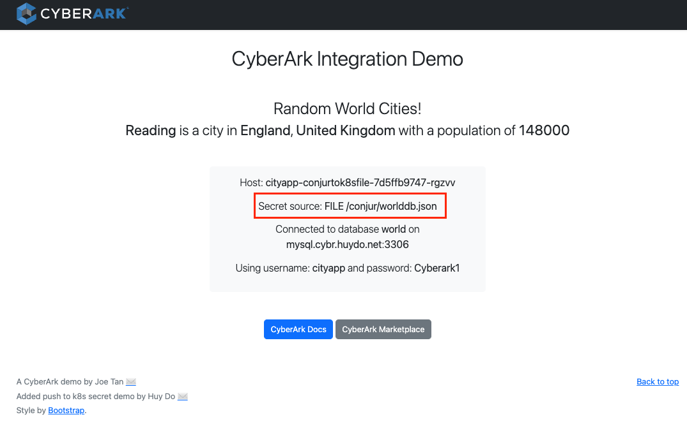

# 3.4. Running cityapp-conjurtok8ssecret
Application cityapp-conjurtok8ssecret is configured with sidecar container (secrets-provider-for-k8s) which is run in the same pod with cityapp. The sidecar will connect to conjur follower pod, using jwt authentication method and check for database credentials. Information will then be pushed into kubernetes secret name ```db-creds``` which is configured in application's namespace (need RBAC configuration to allow update method on k8s secret). When cityapp's main container running, it will access to secret content via files in /etc/secret-volume which is the shared volume that is linked to secret ```db-creds```. The architecture of this method is described at below CyberArk document link.

[CyberArk Secret Provider: Kubernetes Secret mode](https://docs.cyberark.com/Product-Doc/OnlineHelp/AAM-DAP/Latest/en/Content/Integrations/k8s-ocp/cjr-k8s-secrets-provider-ic.htm?tocpath=Integrations%7COpenShift%252FKubernetes%7CApp%20owner%253A%20Set%20up%20workloads%20in%20Kubernetes%7CSet%20up%20workloads%20(cert-based%20authn)%7CSecrets%20Provider%20for%20Kubernetes%7CInit%20container%252FSidecar%7C_____1 "Push to secret")


Login to VM as root, running below command to deploy conjurtok8ssecret
```
/opt/lab/conjur-ocp.local-lab/3.cityapp-php
./34.running-cityapp-conjurtok8ssecret.sh
```

In k8s dashboard's GUI, checking for sidecar's log in conjurtok8ssecret pod, the detail of conjur jwt authentication and secret pushing will be shown as below
```
INFO:  2022/11/20 17:51:05.371062 main.go:62: CSPFK008I CyberArk Secrets Provider for Kubernetes v1.4.4-5f8218a starting up
INFO:  2022/11/20 17:51:05.371238 main.go:226: CSPFK014I Authenticator setting DEBUG provided by environment
INFO:  2022/11/20 17:51:05.371259 configuration_factory.go:82: CAKC070 Chosen "authn-jwt" configuration
INFO:  2022/11/20 17:51:05.371295 main.go:217: CSPFK014I Authenticator setting CONTAINER_MODE provided by annotation conjur.org/container-mode
INFO:  2022/11/20 17:51:05.371305 main.go:226: CSPFK014I Authenticator setting DEBUG provided by environment
INFO:  2022/11/20 17:51:05.371316 main.go:226: CSPFK014I Authenticator setting JWT_TOKEN_PATH provided by environment
INFO:  2022/11/20 17:51:05.371325 main.go:226: CSPFK014I Authenticator setting CONJUR_AUTHN_LOGIN provided by environment
INFO:  2022/11/20 17:51:05.376197 authenticator_factory.go:34: CAKC075 Chosen "authn-jwt" flow
INFO:  2022/11/20 17:51:05.420251 k8s_secrets_client.go:56: CSPFK004I Creating Kubernetes client
INFO:  2022/11/20 17:51:05.420739 k8s_secrets_client.go:21: CSPFK005I Retrieving Kubernetes secret 'db-creds' from namespace 'cityapp'
INFO:  2022/11/20 17:51:05.438234 authenticator.go:63: CAKC066 Performing authn-jwt
INFO:  2022/11/20 17:51:05.550677 authenticator.go:83: CAKC035 Successfully authenticated
INFO:  2022/11/20 17:51:05.550718 conjur_secrets_retriever.go:74: CSPFK003I Retrieving following secrets from DAP/Conjur: [test/host1/host test/host1/user test/host1/pass]
INFO:  2022/11/20 17:51:05.550726 conjur_client.go:21: CSPFK002I Creating DAP/Conjur client
INFO:  2022/11/20 17:51:05.682514 k8s_secrets_client.go:56: CSPFK004I Creating Kubernetes client
INFO:  2022/11/20 17:51:05.683098 k8s_secrets_client.go:40: CSPFK006I Updating Kubernetes secret 'db-creds' in namespace 'cityapp'
INFO:  2022/11/20 17:51:05.690806 provide_conjur_secrets.go:184: CSPFK009I DAP/Conjur Secrets updated in Kubernetes successfully
```

Using browser and go to http://cityapp-conjurtok8ssecret-cityapp.apps-crc.testing to see the result
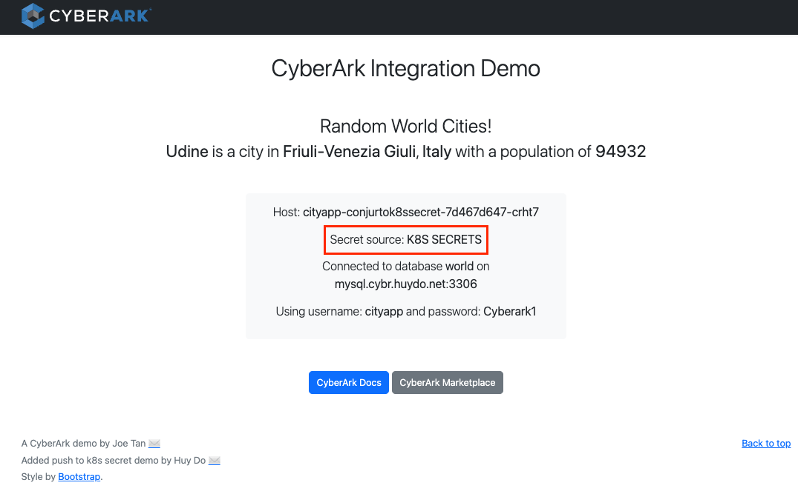

# 3.5. Running cityapp-secretless
Application cityapp-secretless is configured with sidecar container (secretless-broker) which is run in the same pod with cityapp. The sidecar will connect to conjur follower pod, using jwt authentication method and check for database credentials. After that, sidecar will host the mysql service and proxy-ing all mysql queries from main container to database. The ```cityapp``` main container will not need to know database credentials anymore.

The architecture of this method is described at below CyberArk document link.
[CyberArk Secret Provider: Secretless broker](https://docs.cyberark.com/Product-Doc/OnlineHelp/AAM-DAP/12.4/en/Content/Overview/scl_how_it_works.htm?TocPath=Fundamentals%7CSecretless%20pattern%7C_____2 "Secretless broker")


Login to VM as root, running below command to deploy cityapp-secretless
```
cd /opt/lab/conjur-k8s-lab/3.cityapp-setup
./05.running-cityapp-secretless.sh 
```

In Openshift dashboard's GUI, checking for sidecar's log in secretless pod, the detail of conjur jwt authentication and secret pushing will be shown as below
```
2022/11/21 01:02:02 Secretless v1.7.14-552c75c8 starting up...
2022/11/21 01:02:02 Initializing health check on :5335...
2022/11/21 01:02:02 Initialization of health check done. You can access the endpoint at `/live` and `/ready`.
2022/11/21 01:02:02 [WARN]  Plugin hashes were not provided - tampering will not be detectable!
2022/11/21 01:02:02 Trying to load configuration file: /etc/secretless/cityapp-secretless-cm.yaml
2022/11/21 01:02:02 WARN: v1 configuration is now deprecated and will be removed in a future release
2022/11/21 01:02:02 [INFO]  Configuration found. Loading...
2022/11/21 01:02:02 [INFO]  Validating config against available plugins: ssh,ssh-agent,pg,mysql,mssql,basic_auth,conjur,generic_http,aws
2022/11/21 01:02:02 [INFO]  Starting TCP listener on 0.0.0.0:3306...
2022/11/21 01:02:02 [INFO]  cityapp-mysql-handler: Starting service
2022/11/21 01:02:02 Registering reload signal listeners...
```

Using browser and go to http://cityapp-secretless-cityapp.apps-crc.testing to see the result
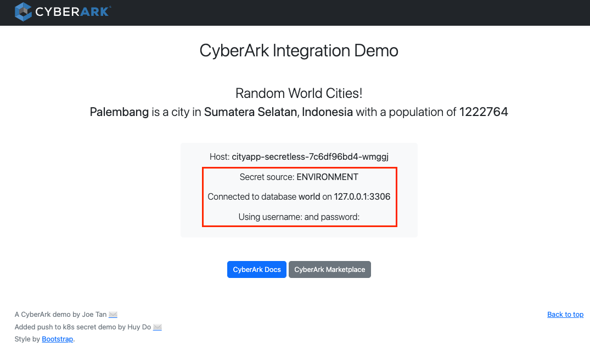

Now you can see the cityapp main container is accessing database at localhost, using empty username and password.

# PART IV: FINAL TESTING
Login to conjur GUI, change the value of secret ```test/host1/user```, ``` test/host1/pass``` and wait for 30 seconds. Refeshing the cityapp webpages to see if the credential values can be changed
# --- LAB END ---
